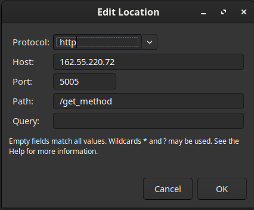
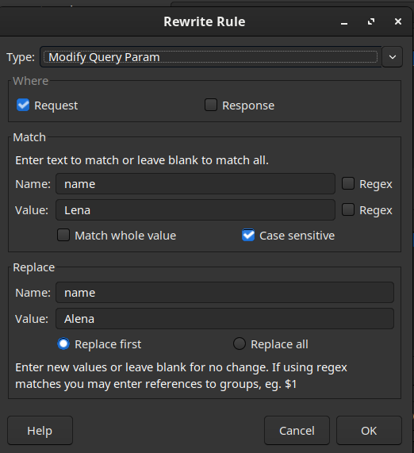
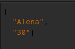
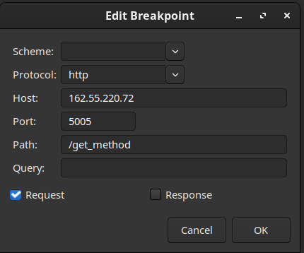
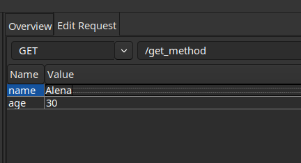
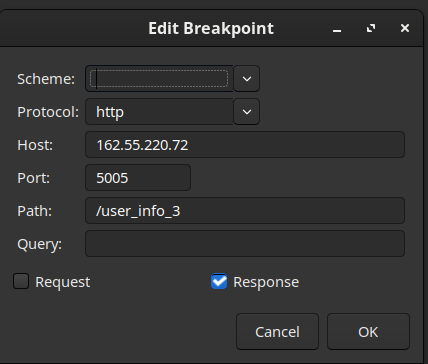
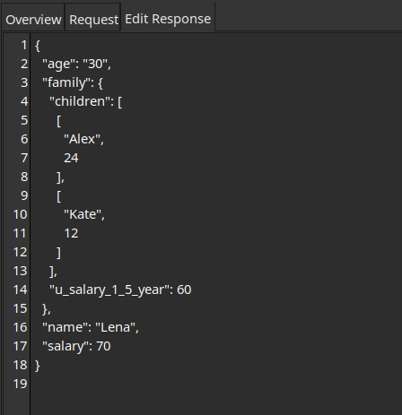

## Ex_0: Сфокусироваться на ниже перечисленных запросах:
```
Protocol: http
IP: 162.55.220.72
Port: 5005
```
# ``` Ex_1:```
```
Method: GET
EndPoint: /get_method
request url params: 
 name: str
 age: int
```
`response`
```
[
    “Str”,
    “Str”
]
```
# Task:
Сделать и в Rewrite, и в BreakPoint (можно отключить чтобы не стопило на каждом запросе)
 ⁃ Подменить url в Charles чтобы в запросе ушло имя которые вы вписали в Postman, а вернулось то, которое вы подставили в Charles.
# `Rewrite`
 В меню Charles переходим в `Tools > Rewrite > Add`



 Добавляем новый сет:

 

# Response



# `BreakPoint`

Добавляем брейкпоинт:



и при следующей отправке этого запроса он “перехватится”

 

# ```Ex_2:```

```
Method: POST
EndPoint: /user_info_3
request form data: 
 name: str
 age: int
 salary: int
```
`response: `
```
{'name': name,
          'age': age,
          'salary': salary,
          'family': {'children': [['Alex', 24], ['Kate', 12]],
                     'u_salary_1_5_year': salary * 4}}

```

# Task:
Сделать и в Rewrite, и в BreakPoint (можно отключить чтобы не стопило на каждом запросе)
 Подменить body в Charles так чтобы в запросе ушла salary которую вы вписали в Postman, а в u_salary_1_5_year цифра вернулась меньше оригинальной из запроса.

# `BreakPoint`

Добавляем брейкпоинт:

  

перехватываем ответ


подменяем данные в  u_salary_1_5_year




# `BreakPoint`


 

