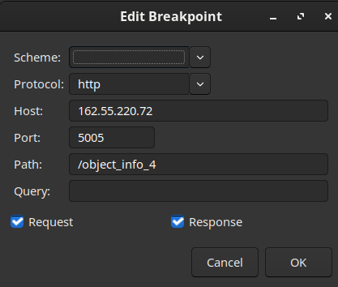
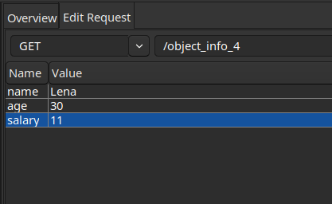
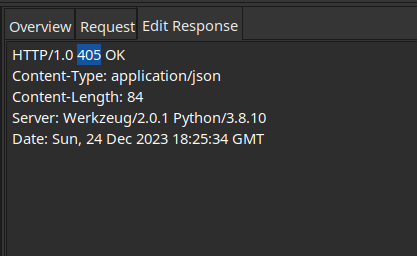
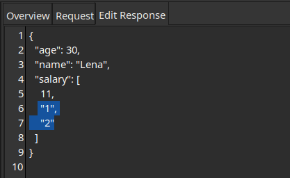
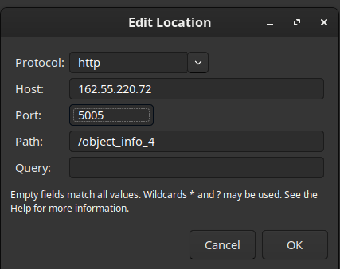
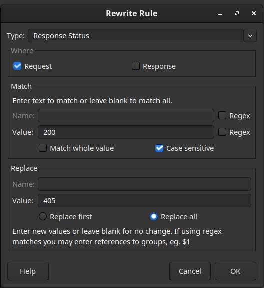
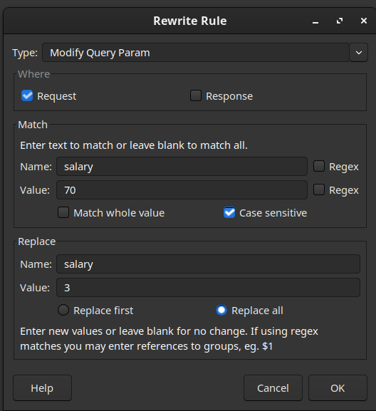
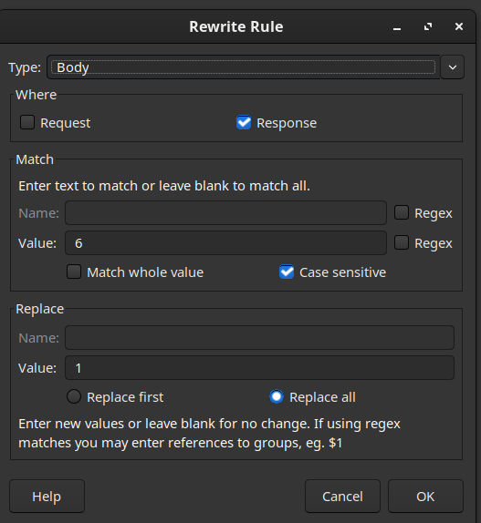

## Ex_0: Сфокусироваться на ниже перечисленных запросах:
```
Protocol: http
IP: 162.55.220.72
Port: 5005
```
# ``` Ex_1:```
```
Method: GET
EndPoint: /get_method
request url params: 
 name: str
 age: int
```
`response`
```
[
    “Str”,
    “Str”
]
```
# Task:
Сделать и в Rewrite, и в BreakPoint (можно отключить чтобы не стопило на каждом запросе)
 ⁃ Подменить url в Charles чтобы в запросе ушло имя которые вы вписали в Postman, а вернулось то, которое вы подставили в Charles.
# `Rewrite`
 В меню Charles переходим в `Tools > Rewrite > Add`


 создаем правила::

 

# Response


# `BreakPoint`

Добавляем брейкпоинт:


и при следующей отправке этого запроса он “перехватится”

 

# ```Ex_2:```

```
Method: POST
EndPoint: /user_info_3
request form data: 
 name: str
 age: int
 salary: int
```
`response: `
```
{'name': name,
          'age': age,
          'salary': salary,
          'family': {'children': [['Alex', 24], ['Kate', 12]],
                     'u_salary_1_5_year': salary * 4}}

```

# Task:
Сделать и в Rewrite, и в BreakPoint (можно отключить чтобы не стопило на каждом запросе)
 Подменить body в Charles так чтобы в запросе ушла salary которую вы вписали в Postman, а в u_salary_1_5_year цифра вернулась меньше оригинальной из запроса.

# `BreakPoint`

Добавляем брейкпоинт:

  

перехватываем ответ 


подменяем данные в  u_salary_1_5_year


# `Rewrite`

В меню Charles переходим в `Tools > Rewrite > Add`


создаем правила:


# `Ex_3:`
```
Method: GET
EndPoint: /object_info_1
request url params: 
 name: str
 age: int
 weight: int
```
```
response: 
{'name': name,
          'age': age,
          'daily_food': weight * 0.012,
          'daily_sleep': weight * 2.5}
```

# Task:
Сделать и в Rewrite, и в BreakPoint (можно отключить чтобы не стопило на каждом запросе)
 ⁃ Подменить параметры запроса в Charles так, чтобы в Postman пришел ответ где другое name, daily_food > weight из запроса, а daily_sleep < weight из запроса.
 
# `BreakPoint`

Добавляем брейкпоинт:


перехватываем ответ и подменяем данные


# `Rewrite`

В меню Charles переходим в `Tools > Rewrite > Add`


создаем правила:


# `Ex_4:`

```
Method: GET
EndPoint: /object_info_3
request url params: 
 name: str
 age: int
 salary: int
```

`response: `

```
{'name': name,
          'age': age,
          'salary': salary,
          'family': {'children': [['Alex', 24], ['Kate', 12]],
                     'pets': {'cat':{'name':'Sunny',
                                     'age': 3},
                              'dog':{'name':'Luky',
                                     'age': 4}},
                     'u_salary_1_5_year': salary * 4}
          }
```

# `Task:`
Сделать и в Rewrite, и в BreakPoint (можно отключить чтобы не стопило на каждом запросе)
- Сделать через Charles так, чтобы сервер вернул 500 код.
- Сделать через Charles так, чтобы сервер вернул 405 код.

# `BreakPoint`

Добавляем брейкпоинт:


перехватываем ответ и подменяем данные


# `Rewrite`

В меню Charles переходим в `Tools > Rewrite > Add`


создаем правила:


или


# `Ex_5:`
```
Method: GET
EndPoint: /object_info_4
request url params: 
 name: str
 age: int
 salary: int
```
`response: `

```
{'name': name,
          'age': int(age),
          'salary': [salary, str(salary * 2), str(salary * 3)]}
```

# Task:

Сделать и в Rewrite, и в BreakPoint (можно отключить чтобы не стопило на каждом запросе)
 ⁃ Сделать через Charles так, чтобы сервер вернул 405 ошибку.
 ⁃ Подменить salary в request
 ⁃ Подменить (salary * 2) в response

# `BreakPoint`

Добавляем брейкпоинт:



перехватываем ответ и подменяем данные







# `Rewrite`

В меню Charles переходим в `Tools > Rewrite > Add`



создаем правила:








# `Ex_6:`
```
Method: POST
EndPoint: /user_info_2
request form data: 
 name: str
 age: int
 salary: int
```

response: 
```
{'start_qa_salary': salary,
          'qa_salary_after_6_months': salary * 2,
          'qa_salary_after_12_months': salary * 2.7,
          'qa_salary_after_1.5_year': salary * 3.3,
          'qa_salary_after_3.5_years': salary * 3.8,
          'person': {'u_name': [user_name, salary, age],
                     'u_age': age,
                     'u_salary_5_years': salary * 4.2}
          }
```

# Task:
Сделать и в Rewrite, и в BreakPoint (можно отключить чтобы не стопило на каждом запросе)
 ⁃ Сделать через Charles так, чтобы в Postman вернулся ответ, в котором qa_salary_after_1.5_year переименовано в qa_salary_after_1.5_month
 ⁃ Сделать так чтобы qa_salary_after_3.5_years было меньше qa_salary_after_12_months в response
